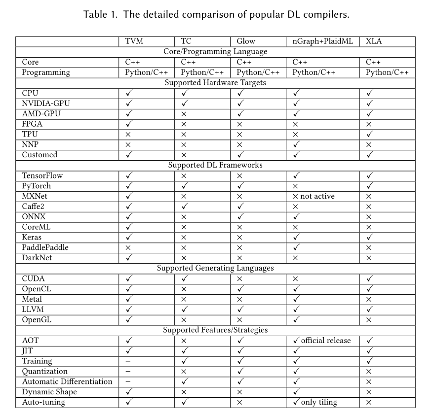

# Note about tvm

- [X] brieft introduction
- [X] compile mxnet model for local Nvidia GPU 
- [ ] GluonCV : SSD : ssd_512_resnet18_v1_voc
- [ ] Gluoncv : AlphaPose
- [ ] Others . Will add in the future

## Introduction

Apache(incubating) TVM is an open deep learning compiler stack for CPUs, GPUs, and specialized accelerators. It aims to close the gap between the productivity-focused deep learning frameworks, and the performance- or efficiency-oriented hardware backends. TVM provides the following main features:

* Compilation of deep learning models in Keras, MXNet, PyTorch, Tensorflow, CoreML, DarkNet into minimum deployable modules on diverse hardware backends.
* Infrastructure to automatic generate and optimize tensor operators on more backend with better performance.

  [source](https://github.com/apache/incubator-tvm/issues/2469#issuecomment-455940771)

In a short-word by using Deep Learning compiler we can: 

* deploy deep learning model into target device with minimal software requirement
* optimize model, so it will acquire it speed capacibility on target device

## Compare with other framework

Available Deep learning compiler on the market. 

* [TC : Tensor Comprehensions](https://github.com/facebookresearch/TensorComprehensions)  開発中断, DO NOT use this
* [GLow: pytorch/glow: Compiler for Neural Network hardware](https://github.com/pytorch/glow)
* [Intel nGraph: Compiler](https://github.com/NervanaSystems/ngraph) + [Intel plaidml: A platform for making deep learning work everywhere](https://github.com/plaidml/plaidml)
* [Google : Tensorflow : XLA](https://www.tensorflow.org/xla)

Comparision of popular Deep Learning compilers. 



Source : [The Deep Learning Compiler: A Comprehensive Survey](https://arxiv.org/pdf/2002.03794.pdf)

## How good is TVM ?

The biggest question araise here is which Deep Learning compiler produce a fastest model. Unfortunately, it's still unknown. One big reason is all of above Deep Learning compilers are still in early stage and leep envolving very fast through time. Currently, no-one bother does a full benchmark to compare those compiler. 

From my point of view, instead of choosing a *better framework*, sticking with your familiar framework and its built-in compiler is safer choice. If you work with Tensorflow then use XLA. If you work with Pytorch then use Glow. I use Mxnet so I use TVM.  

Here's some benchmark that I found on the Internet. It's just for referencing

* [tvm benchmark result on ARM, Mobile GPU, Nvidia GPU, AMD GPU](https://github.com/apache/incubator-tvm/wiki/Benchmark#nvidia-gpu)
* [CPU backend performance running Resnet50 and VGG19 in XLA, TVM, Glow : Figure 11](https://arxiv.org/abs/1805.00907)
* [NVIDIA RTX 2080 Ti Benchmarks for Deep Learning with TensorFlow: Updated with XLA & FP16](https://blog.exxactcorp.com/nvidia-rtx-2080-ti-deep-learning-benchmarks-for-tensorflow-updated-with-xla-fp16/)

## Using TVM

If we ignore all of compiling techniques, the workflows of TVM looks like follow

1. Host machine : install tvm runtime + compiler [tvm installation](https://tvm.apache.org/docs/install/index.html)
2. Target devices : install tvm runtime then connect to Host machine through rpc : [cross compilation and rpc](https://tvm.apache.org/docs/tutorials/cross_compilation_and_rpc.html#build-tvm-runtime-on-device)
3. Use TVM's auto tuning (autotvm) to compile deep learning model and test on connecting target devices
   1. [ARM CPU](https://tvm.apache.org/docs/tutorials/autotvm/tune_relay_arm.html#)
   2. [Mobile GPU](https://tvm.apache.org/docs/tutorials/autotvm/tune_relay_mobile_gpu.html#)
   3. [Raspberry PI](https://tvm.apache.org/docs/tutorials/frontend/deploy_model_on_rasp.html#)
   4. [Nvidia GPU](https://tvm.apache.org/docs/tutorials/autotvm/tune_relay_cuda.html#)

Note: after compiling we will have a set of *autotvm configurations (parameters)* . tvm team does publish some pre-tuned autotvm configuration at [https://github.com/uwsampl/tophub](https://github.com/uwsampl/tophub). During the Host machine's compilation, tvm will download and store at **~/.tvm/tophub**. Those configurations are pre-tune using devices available at :  [tvm benchmark](https://github.com/apache/incubator-tvm/wiki/Benchmark) . If your devices don't be listed here, then you need to do the auto-tuning by your self. 

Note : without autotvm configuration, the Deep Learning model can still be used but we will not get speed improvement, in some case it will be slow down.

## Playing with TVM

My target device is **Nvidia GTX-1060Ti**

### Image recognition: cifar_resnet20_v1

* Mxnet + cifar_resnet20_v1 + tvm 

```bash
(py3) gachiemchiep:tvm$ python tune_relay_cuda.py --model mxnet

Extract tasks...
Use : cifar_resnet20_v1
Tuning...
[Task  1/12]  Current/Best:  263.70/ 355.86 GFLOPS | Progress: (1232/2000) | 2870.47 s Done.
[Task  2/12]  Current/Best:    2.02/ 462.56 GFLOPS | Progress: (960/2000) | 2470.03 s Done.
[Task  3/12]  Current/Best:  105.79/ 110.12 GFLOPS | Progress: (1120/2000) | 1905.31 s Done.
[Task  4/12]  Current/Best:  318.39/ 369.88 GFLOPS | Progress: (912/2000) | 1875.41 s Done.
[Task  5/12]  Current/Best:  597.51/ 647.72 GFLOPS | Progress: (912/2000) | 1605.43 s Done.
[Task  6/12]  Current/Best:  692.17/ 860.22 GFLOPS | Progress: (752/2000) | 1615.65 s Done.
[Task  7/12]  Current/Best:  121.79/ 124.60 GFLOPS | Progress: (1680/2000) | 3980.79 s Done.
[Task  8/12]  Current/Best:  549.70/ 613.67 GFLOPS | Progress: (672/2000) | 1087.90 s Done.
[Task  9/12]  Current/Best:  624.06/ 718.05 GFLOPS | Progress: (1248/2000) | 3163.54 s Done.
[Task 10/12]  Current/Best:  118.14/ 123.49 GFLOPS | Progress: (1120/2000) | 2242.70 s Done.
[Task 11/12]  Current/Best:  513.12/ 570.55 GFLOPS | Progress: (736/2000) | 1192.79 s Done.
[Task 12/12]  Current/Best:  470.26/ 666.59 GFLOPS | Progress: (1632/2000) | 4297.47 s Done.
Compile...
Evaluate inference time cost...
Mean inference time (std dev): 0.23 ms (0.00 ms)

```

* Mxnet + cifar_resnet20_v1 

```bash
(py3) gachiemchiep:tvm$ python demo_cifar10.py 
[17:31:23] src/operator/nn/./cudnn/./cudnn_algoreg-inl.h:97: Running performance tests to find the best convolution algorithm, this can take a while... (set the environment variable MXNET_CUDNN_AUTOTUNE_DEFAULT to 0 to disable)
Start Evaluating
Inference time:   5.241923 ms
The input picture is classified as [deer], with probability 0.843.
```

So by using tvm the inference time is reduced from *5.241923 ms* to *0.23 ms*. 

### Object detection : ssd_512_resnet50_v1_voc.py


```bash
# use 8 threads
export TVM_NUM_THREADS=10

python tune_relay_cuda.py --model mxnet
```

* Mxnet + ssd_512_resnet50_v1_voc

```bash

/home/gachiemchiep/miniconda3/envs/py3/lib/python3.7/site-packages/mxnet/gluon/block.py:1389: UserWarning: Cannot decide type for the following arguments. Consider providing them as input:
	data: None
  input_sym_arg_type = in_param.infer_type()[0]
[17:17:33] src/operator/nn/./cudnn/./cudnn_algoreg-inl.h:97: Running performance tests to find the best convolution algorithm, this can take a while... (set the environment variable MXNET_CUDNN_AUTOTUNE_DEFAULT to 0 to disable)
Inference time:    7.2 ms

```

## Reference

* General

1. **Must read** [The Deep Learning Compiler: A Comprehensive Survey](https://arxiv.org/pdf/2002.03794.pdf)
2. [dive into deep learning](https://d2l.ai/)
3. [Dive into Deep Learning Compiler](http://tvm.d2l.ai/) -> 演算高速化の細かい説明
4. [Prelude to halide_public](https://www.slideshare.net/fixstars/prelude-to-halidepublic-108059122)
5. [Halide による画像処理プログラミング入門](https://www.slideshare.net/fixstars/halide-82788728)
9. [ウェブブラウザ向け深層学習モデル高速実行フレームワーク「WebDNN」](https://speakerdeck.com/kiikurage/uebuburauzaxiang-keshen-ceng-xue-xi-moderugao-su-shi-xing-huremuwaku-webdnn?slide=40)

* Glow 

2. [Facebook Glow Compiler のソースコードをグダグダ語る会](https://www.slideshare.net/ssuser479fa3/facebook-glow-compiler)

* tvm

1. [Tvm benchmark result](https://github.com/apache/incubator-tvm/wiki/Benchmark)
2. [Performance Benchmark](https://github.com/apache/incubator-tvm/tree/master/apps/benchmark)
3. [TVM Runtime System](https://tvm.apache.org/docs/dev/runtime.html)
4. [GPU 対応した AutoTVM を試す](https://qiita.com/masahi/items/dc4a9d74e5cf2c345bdf) : 2018
5. **Must read**[TVM の紹介](https://www.slideshare.net/masahi129/tvm-122375943) : 2018
6. [TVM : Automatic Kernel Optimization for Deep Learning on All Hardware Platforms](https://tvm.apache.org/2018/10/03/auto-opt-all)
7. [TVM: An Automated End-to-End Optimizing Compiler for Deep Learning](https://www.usenix.org/system/files/osdi18-chen.pdf)   or this link [arvix](https://arxiv.org/abs/1802.04799)
8. [TVM runtime system](https://tvm.apache.org/docs/dev/runtime.html)


End

