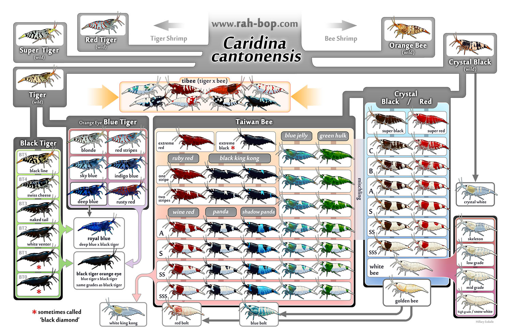
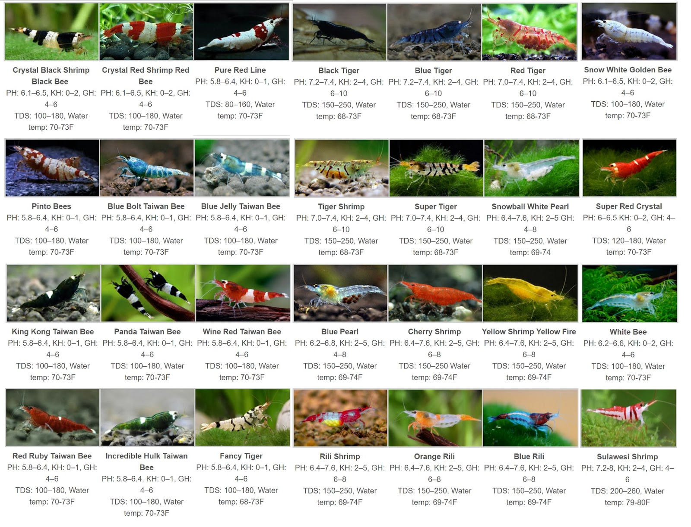

# Tổng hợp chung về các dòng tép cảnh

## Tóm tắt

Giới thiệu chung về các dòng tép cảnh. 

## Chi tiết

Các dòng tép chung và phân loại khoa học. 

| Tên         | Họ      | Chi         | Loài            |
|-------------|---------|-------------|-----------------|
| Tép yamato  | Atyidae | Caridina    | C. multidentata |
| Tép anh đào | Atyidae | Neocaridina | N. davidi       |
| Tép ong     | Atyidae | Caridina    | C. cantonensis  |

### Tép yamato (Amano, Minami-numa  shrimp) 

Tên khoa học : [Caridina multidentata](https://vi.wikipedia.org/wiki/Caridina_multidentata)、màu sắc xấu, nuôi để ăn tảo, rêu hại. 

### Tép anh đào (Red Cherry Shrimp)

Tên khoa học : [Neocaridina davidi](https://en.wikipedia.org/wiki/Neocaridina_davidi), trên thân chỉ có một màu sắc duy nhất, giá thành rẻ, ăn tảo rêu hại. Tùy vào màu sắc, độ đậm nhạt mà chia thành các dòng như sau.  

* Red Cherry Shrimp 

* Fire red cherry shrimp 

* Snow white cherry shrimp

* Chocolate cherry shrimp 

* orange cherry shrimp

* yellow cherry shrimp 

* blue cherry shrimp

* blue best cherry shrimp

* Larmax blue cherry shrimp

* Emerald cherry shrimp

* Orange gold cherry shrimp 

Chú ý : màu sắc sặc sỡ là tính trạng lặn của tép anh đào. Khi nuôi trong hồ, sau một thời gian do hiện tượng đồng huyết nên nhiều tép con sinh ra sẽ trở về màu nguyên thủy là màu xám. Đặc biệt khi nuôi nhiều loại tép cherry với nhau thì điều này xảy ra càng nhanh. Cho nên để giữ cho một hồ tép đẹp, chúng ta chỉ nên nuôi một loại duy nhất. Và trong quá trình nuôi cần bắt và loại bỏ những con tép có màu xấu. 

### Tép ong (Red Cherry Shrimp)

Tên khoa học [Caridina cantonensis](https://en.wikipedia.org/wiki/Bee_shrimp). Loaì tép này có các vành màu (đỏ hoặc đen) nổi rõ trên cơ thể nên giống con ong nên gọi là tép ong. Tép ong là loài có nguồn gốc bản địa ở phía Nam Trung Hoa. Các loài tép ong trong tự nhiên bao gồm : Orange Bee, Crystal Black, Red Tiger, Super Tiger, Tiger. Tép ong tự nhiên màu sắc rất xấu xí, nhưng thông qua quá trình lai tạo trong hàng chục năm nhiều loài tép ong xinh đẹp đã ra đời. 

Các dòng tép ong thông dụng, vừa túi tiền. 

* Red bee shrimp 

* Red tiger bee shrimp 

* Black bee shrimp

* Black tiger bee shrimp

* Green bee shrimp

* Blue jelly bee shrimp

* Black king kong 

Cũng giống như tép anh đào, gen qui định màu sắc sặc sỡ là tính trạng lặn. Nên khi nuôi chung một thời gian, tép con sinh ra sẽ mất dần gen qui định màu sắc sặc sỡ, trở về tính trạng nguyên thủy cuả nó. Cho nên khi nuôi tép ong cần thường xuyên lọc bỏ các tép con xấu và mua thêm tép bố mẹ để tăng cường nguồn gen tốt. 

Cách nuôi dưỡng tép ong 

## Link tham khảo 

1. [https://aquakoke.com/tropical-fish-shrimp-type/#toc2](https://aquakoke.com/tropical-fish-shrimp-type)
2. [https://aquariuminfo.org/shrimp.html](https://aquariuminfo.org/shrimp.html)
3. [Tibee, Taitibee, Pinto, Mischling, F1, F2 terms explained](https://skfaquatics.com/forum/forums/topic/7637-tibee-taitibee-pinto-mischling-f1-f2-terms-explained/)